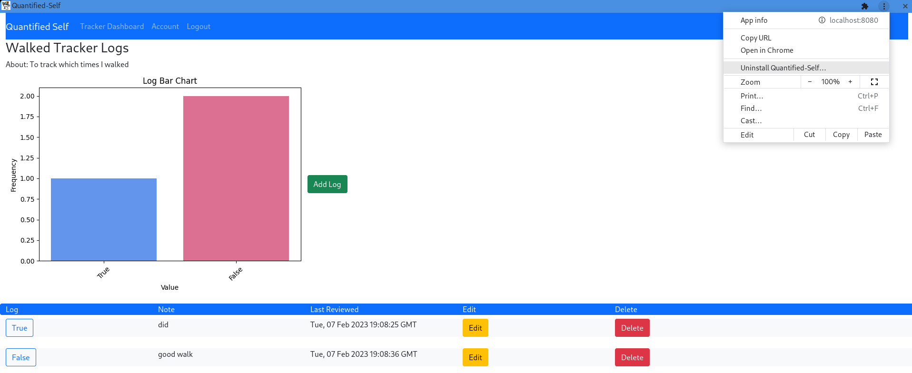

# Quantified Self-App

Quantified Self-App is a web application that tracks life parameters. Logs values into each tracker and plots trendlines on the basis of the logs. It sends monthly timed reports via emails to the user.

## Setup using Python virtual environment

1. Clone the repo
   ```sh
   git clone https://github.com/priyanka-maz/Quantified-Self-Application
   ```
2. Install [MailHog](https://github.com/mailhog/MailHog) as per your system's requirements.

3. After cloning or downloading the codebase src/ dir to /path/to/src
    ```sh
    python3 -m venv /path/to/src
    cd /path/to/src
    python3 -m pip install -r requirements.txt
    # Skip below command if using in a development env
    export ENV=production
    ./app.sh
    ```
4. ```SENDER_ADDRESS``` in src/application/config.py has been set to ```dummy@gmail.com```

   Replace the value with the sender address you want the users of this app to receive their reports from.
   
## Screenshots





## Features

- User Registration and Session Cookie based authentication for login.
- Passwords are stored using Bcrypt Hashing Algorithm.
- User Accounts may be deleted.
- Users may logout.
- Users may add Trackers of the following types:
    - Multiple Choice (user choice)
    - Numerical
    - Boolean
    - Time Duration
- Logs may be added for each tracker.
- CRUD functionality implemented for both trackers and logs.
- Matplotlib is used to render trendlines of logs under a tracker.
- Caching for root page is done.
- Export and Import for data in csv format is enabled.
- Monthly Reports are emailed via a fake SMTP server to the user email.
- WeasyPrint is used for email generation.
- Triggered and scheduled celery endpoints exist.
- Progressive Web App of this may be locally installed.
- All pages are dynamically rendered with Vue.

